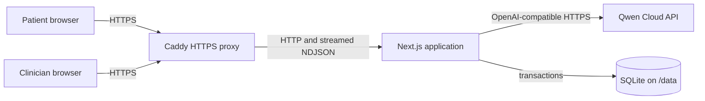
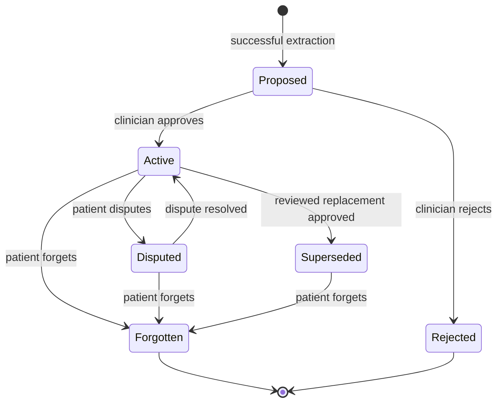
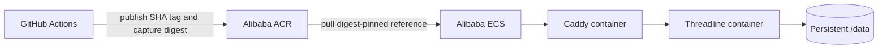

# Threadline architecture and data lifecycle

Threadline is a single-instance Next.js application with a real cross-session
memory pipeline. This document defines its module boundaries, trust boundaries,
storage model, request flows, and deliberate hackathon constraints.

## System context

The browser never calls Qwen directly and never receives infrastructure
credentials. Caddy is the only public network entry point.



The production topology intentionally uses one application instance and one
persistent SQLite volume. Horizontal replicas require a shared database,
coordinated rate limiting, and coordinated Next.js caches, which are outside the
hackathon scope.

## Trust boundaries

Every request crosses explicit authorization and data-handling boundaries.

- The public boundary terminates at Caddy, which provides HTTPS and removes its
  identifying response header.
- The session boundary uses an opaque role-bound cookie. The server stores only
  its hash and validates expiry, workspace, role, and ownership on each request.
- The workspace boundary prevents one demo visitor from reading another
  visitor's synthetic patient or clinician records.
- The care boundary requires an active patient-clinician relationship and
  consent before a memory can be reviewed or retrieved.
- The model boundary treats Qwen output as untrusted data and validates
  structured extraction before persistence.
- The memory boundary treats stored statements as untrusted prompt context.
  Escaping, explicit delimiters, and system instructions reduce the chance that
  instruction-like memory text can influence prompt control flow.

## Module boundaries

The modular monolith separates policy from infrastructure so tests can replace
Qwen and SQLite independently.

- **Domain:** memory categories, lifecycle transitions, retrieval scoring,
  consent, and authorization invariants.
- **Application:** session orchestration, risk routing, finalization, clinician
  review, forgetting, cleanup, and rate limiting.
- **Ports:** Qwen operations, repositories, clocks, identifier generation, and
  session hashing.
- **Adapters:** OpenAI-compatible Qwen client, Drizzle and SQLite persistence,
  Next.js cookies, and HTTP route handlers.
- **Presentation:** server-rendered pages and narrowly scoped client components
  for chat streaming, review actions, and responsive panels.

Request-specific state stays inside request and application-service scopes.
Mutable user state never lives at module scope.

## Storage model

SQLite stores the complete demo state under a synthetic workspace identifier.
Indexes cover workspace, patient, lifecycle status, and timestamps.

- `demo_workspaces` stores isolation, seed version, creation, and expiry.
- `users` stores the synthetic persona and its role.
- `care_relationships` stores patient-clinician linkage and consent.
- `auth_sessions` stores the hashed opaque token, role, and expiry.
- `therapy_sessions` stores active, finalizing, finalized, or failed state.
- `session_messages` stores temporary content for an unfinished session.
- `session_summaries` stores validated narrative, themes, follow-ups, flags,
  review state, model, and prompt version.
- `memories` stores category, lifecycle state, importance, confidence, source,
  optional supersession, and embedding metadata.
- `memory_events` stores review and lifecycle audit events.
- `retrieval_runs` stores sanitized selection evidence and latency.
- `rate_limit_buckets` stores public-demo request counters.

Embeddings use Float32 binary storage with their model and dimension. Error logs
contain only request identifiers, route paths, HTTP status, and stable error
codes—not messages, prompts, memory text, provider responses, or secrets.

## Memory lifecycle

A memory becomes usable only after explicit review. Contradictions never
silently replace an approved statement.



Forgetting clears the statement and embedding. The remaining audit tombstone
contains only identifiers, action type, actor, and timestamp.

## Live reply flow

The session endpoint returns newline-delimited JSON so the browser can render
tokens and evidence without waiting for the complete response.

1. Validate the role-bound session, workspace, patient ownership, message size,
   session state, and rate limit.
2. Build a retrieval query from the latest message and two previous exchanges,
   capped at 2,000 characters.
3. Run the query embedding and conservative model risk classification in
   parallel.
4. Combine model classification with deterministic crisis-pattern checks.
5. For high risk, suppress generated therapeutic advice, return deterministic
   support guidance, and create a clinician follow-up flag.
6. For normal risk, retrieve eligible memories and construct a delimited,
   context-limited prompt.
7. Stream `token`, `trace`, `done`, or `error` events to the browser.
8. Persist the assistant response only while the session remains active.

The Memory Trace reports sanitized evidence: candidate count, selected memory
identifiers and categories, score components, context size, model, prompt
version, and latency.

## Retrieval policy

Retrieval considers only active, approved, consent-eligible, non-forgotten
memories for the current patient.

```text
score = 0.65 * semantic_similarity
      + 0.15 * normalized_importance
      + 0.10 * recency
      + 0.10 * extraction_confidence
```

The selector returns no more than five memories, no more than two from one
category, and no more than 3,200 characters of memory context. The category cap
prevents one repeated theme from crowding out other relevant context.

## Finalization flow

Finalization converts temporary session content into validated, reviewable
records.

1. Lock the active session by moving it to `finalizing`.
2. Ask `qwen3.7-plus` for a JSON summary, themes, follow-ups, risk flags, and
   candidate memories.
3. Validate the response with Zod and retry malformed output once with a repair
   prompt.
4. Embed valid memory candidates with `text-embedding-v4` at 1,024 dimensions.
5. In one SQLite transaction, save the summary and proposed memories, delete
   raw messages, append audit events, and mark the session `finalized`.
6. On failure, mark the session `failed` without deleting its messages so the
   patient can retry.
7. Remove abandoned failed or active session messages after 24 hours.

The transaction is the retention guarantee: a session cannot report successful
finalization while its raw transcript remains stored.

## Model boundary

The server-side Qwen adapter exposes four operations and centralizes retry,
timeout, and error translation behavior.

- `streamReply()` produces the reflection response stream.
- `classifyRisk()` returns conservative structured risk metadata.
- `extractSession()` returns the structured finalization payload.
- `embed()` returns fixed-dimension vectors for retrieval.

The adapter uses `qwen3.7-plus`, `qwen3.6-flash`, and `text-embedding-v4` by
default. It retries network failures, HTTP 429 responses, and 5xx responses with
capped exponential backoff and jitter. It does not retry authorization,
validation, or deterministic safety failures.

## HTTP contracts

Route handlers enforce the same authorization policy as the application
services they call.

- `POST /api/auth/demo` enters a workspace as patient or clinician.
- `POST /api/auth/logout` invalidates the current role session.
- `GET /api/me` returns the current synthetic actor.
- `POST /api/sessions` starts a patient session.
- `GET /api/sessions/:id` returns an authorized session.
- `POST /api/sessions/:id/messages` returns streamed NDJSON events.
- `POST /api/sessions/:id/finalize` performs transactional extraction.
- `GET /api/sessions/:id/summary` returns an authorized summary.
- `GET /api/sessions/:id/retrieval-trace` returns sanitized evidence.
- `GET /api/patients/:id/memories` returns authorized memory records.
- `PATCH /api/memories/:id` edits a proposed memory.
- `POST /api/memories/:id/approve` approves a proposal.
- `POST /api/memories/:id/reject` rejects a proposal.
- `POST /api/memories/:id/dispute` disputes an active memory.
- `POST /api/memories/:id/forget` removes retained memory content.
- `GET /api/health` reports process and database readiness without secrets.

Non-streaming errors use a stable envelope containing `code`, `message`,
optional `fieldErrors`, and `requestId`. User-facing messages do not expose
provider payloads or internal stack traces.

## Deployment topology

The same immutable image moves from CI to Alibaba Cloud Container Registry and
then to one Alibaba ECS host.



Caddy terminates HTTPS and forwards streams without response buffering. The app
runs as UID 1001, reads runtime secrets from a host-owned file, and stores its
only persistent application state in the mounted data directory. Read
[the deployment guide](deployment.md) for provisioning, rollout, backup, and
rollback procedures.

## Deliberate constraints

The following capabilities remain outside this hackathon implementation.

- Real patient data, clinical operations, or healthcare compliance claims
- Electronic health record integration and audio transcription
- Public registration, billing, or organization administration
- Full-transcript retrieval-augmented generation
- Autonomous diagnosis, treatment, or clinical decision-making
- Horizontal replicas without shared persistence and cache coordination
